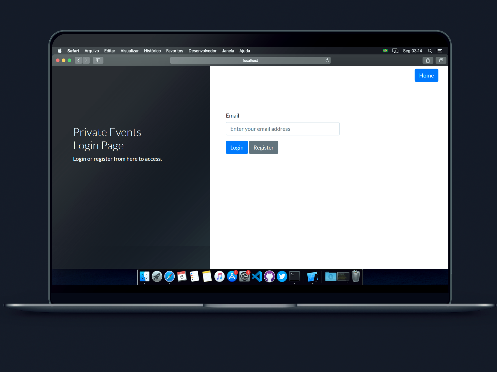

<h3 align="center">Kevin Portfolio</h3>

<h4 align="center">
  🛸 Stay hungry, stay foolish
</h4>

    

<a href="#about">About</a>&nbsp;&nbsp;&nbsp;|&nbsp;&nbsp;&nbsp;
<a href="#installing">Installing</a>&nbsp;&nbsp;&nbsp;|&nbsp;&nbsp;&nbsp;
<a href="#built_using">Built with</a>&nbsp;&nbsp;&nbsp;|&nbsp;&nbsp;&nbsp;
<a href="#author">Author</a>

  

## 🧐 About 
<h3 align="center">This is my portfolio, I used the  <a href="https://github.com/cobidev/simplefolio" target="_blank">Simplefolio</a> and made some changes, so it could fit in my taste. Hope you guys enjoy it.

## Features

⚡️ Modern UI Design + Reveal Animations\
⚡️ One Page Layout\
⚡️ Styled with Bootstrap v4.3 + Custom SCSS\
⚡️ Fully Responsive\
⚡️ Valid HTML5 & CSS3\
⚡️ Optimized with Webpack\
⚡️ Well organized documentation

## 🔧 Built with

- [Ruby on Rails](https://rubyonrails.org/) - A web-application framework that includes everything needed to create database-backed web applications according to the Model-View-Controller (MVC) pattern.
- [Bootstrap 4](https://getbootstrap.com/docs/4.3/getting-started/introduction/) - Front-end component library
- [Sass](https://sass-lang.com/documentation) - CSS extension language
- [Capybara](https://github.com/teamcapybara/capybara) - Acceptance test framework for web applications 
- [Rspec](https://rspec.info/) - JBehaviour Driven Development for Ruby. Making TDD Productive and Fun.
- [Bootsnipp](https://bootsnipp.com/) - Design elements, playground and code snippets for Bootstrap HTML/CSS/JS framework 
- [PhotoShop CC](https://adobe.com/) - The most powerfull photo editor ever made;

## ✒️  Autor 

👤 **Kevin Alves**

- Github: [@kevincappuccino](https://github.com/kevincappuccino)
- Twitter: [@kevincappuccino](https://twitter.com/kevinfrontend)
- Linkedin: [@kevinn](https://www.linkedin.com/in/kevinnn/)

## 🤝 Contributing

Contributions, issues, and feature requests are welcome!

Feel free to check the [issues page](https://github.com/kevincappuccino/private-events/issues).

## 👍 Show your support

Give a ⭐️ if you like this project!

## 🏆 Acknowledgement

- Prof.: Leonardo Leitão

## 📝 License

This project is free to use as learning purposes. For any external content (e.g. logo, images, ...), please contact the proper author and check their license of use.
